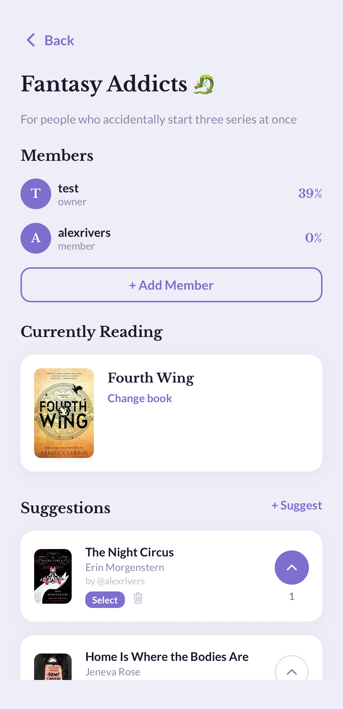

# Chapter Chat

> A full-stack social reading tracker built with React Native, Expo, and Supabase — featuring AI-powered recommendations and reading list curation, real-time messaging, a 2.3M-book catalog, social feeds, analytics dashboards, and native iOS widgets.

---

## Screenshots

<div align="center">

| Home | Stats | Book Detail |
|------|-------|-------------|
|  |  |  |

| Library | Direct Messages | Book Club |
|---------|-----------------|-----------|
|  |  |  |

</div>

---

## Highlights

- **AI-powered recommendations** — Claude analyzes your reading history, runs parallel Hardcover searches, and returns personalized picks with a one-sentence rationale for each
- **AI reading list curation** — Claude organizes your Want to Read shelf into groups (series, author, genre) and can reorder them around a reading goal
- **15+ database migrations** across a normalized PostgreSQL schema with row-level security on every table
- **2.3M+ book catalog** sourced from the UCSD GoodReads dataset, processed with custom Node.js streaming pipelines
- **Real-time direct messaging** via Supabase Realtime subscriptions with optimistic UI and read receipts
- **Hardcover GraphQL API** integration behind a Supabase Edge Function proxy — API keys never leave the server
- **9 runtime color themes** via a React context-based design system; all screens re-render without navigation
- **Native iOS Live Activity** widget surfacing reading progress to the home screen via a custom Expo native module
- **File-based typed routing** with Expo Router; all navigation is declarative and fully TypeScript-typed end-to-end

---

## Feature Overview

### Reading Tracker
- Timed reading sessions (built-in stopwatch) and manual session logging with start/end page, duration, and date
- Edit and delete individual reading sessions
- Multi-book carousel on the home screen for users reading several books simultaneously
- Progress tracking by page number or percentage (ebooks/audiobooks)
- Add books not found in search via a fully manual entry flow
- Quick-log to mark a read day without detailed tracking

### Library & Discovery
- Four shelves: Reading, Want to Read, Read, DNF — with sort, search, and half-star rating display
- **AI reading list curation** — tap "Organize with AI" on the Want to Read shelf to group books by series, author, and genre; optionally provide a goal (e.g. "finish a series this month") to reprioritize the order
- **AI book recommendations** — tap "Recommend something to me" in Search to get personalized picks powered by Claude, with a one-sentence rationale per book and a refresh button for new results
- "More Like This" recommendations computed from genre overlap across the book catalog
- Series pages grouping related books, synced from Hardcover
- Author detail pages with full bibliography

### Stats & Analytics
- Reading calendar heatmap (GitHub-style) with per-month navigation
- Weekly/monthly page-count bar charts with tap-to-inspect tooltips
- Genre breakdown pie chart
- Pages-by-day-of-week distribution
- Rating histogram
- Running totals: pages, hours, sessions, streaks, and yearly goal progress

### Social
- Activity feed showing friends' reading events (started, finished, sessions shared)
- Likes and threaded comments on activity events
- Follow / unfollow with follow-request approval flow for private accounts
- Public user profiles with stats, shelf counts, and follower/following lists (Instagram-style)
- Curated community reviews with rating breakdown bars and Most Helpful / Most Recent sorting

### Direct Messaging
- Inbox screen listing all conversations sorted by recency with unread indicators
- Real-time chat via Supabase Realtime `postgres_changes` subscriptions
- Automatic read receipts on conversation open
- Message button on every user profile; conversations created on demand

### Book Clubs
- Create clubs, manage members, set a current reading book
- Threaded discussion posts
- **Book suggestion system**: any member can suggest a book (Hardcover search), other members upvote suggestions; owner can promote a suggestion to current book with one tap

### Reviews & Ratings
- GoodReads seeded reviews (up to 20 per book, most-helpful first) with sort toggle
- Community reviews from other app users
- Friend reviews from followed users, shown with finish date
- Aggregate rating + per-star breakdown bars sourced from GoodReads metadata

### Notifications
- Configurable daily reading reminders and streak-protection alerts
- Push notifications for club discussion posts (Expo push via Supabase Edge Function)
- In-app notification inbox with unread badge

### Personalization
- 9 selectable color themes applied at runtime with no reload
- Editable display name, username (with uniqueness check), bio, and avatar upload to Supabase Storage
- Public / private account toggle with follow-request workflow

---

## Data Pipeline

The book catalog is built from multiple sources processed with custom streaming scripts:

| Script | Purpose |
|--------|---------|
| `import-goodreads-library.mjs` | Imports a personal GoodReads library export CSV; enriches each book by querying the Hardcover API and the GoodReads books dataset |
| `import-goodreads-books.mjs` | Enriches existing books (description, cover, ISBN, publisher, year) by streaming through 2.36M records |
| `import-popular-books.mjs` | Imports highly-rated books from the full dataset to expand the recommendation pool |
| `import-reviews.mjs` | Streams 15.7M review records and imports up to 10 per book, matched by GoodReads ID |
| `import-authors.mjs` | Populates the authors table (829K records) and links books via `goodreads_author_id` |
| `update-genres.mjs` | Updates genre tags from the curated `goodreads_book_genres_initial.json.gz` dataset |
| `patch-goodreads-ids.mjs` | Fuzzy title-matching pass to backfill `goodreads_id` on books missing the link |

All scripts use Node.js `readline` streaming to avoid loading multi-GB files into memory, and batch Supabase upserts for efficiency.

---

## Tech Stack

| Layer | Technology |
|-------|-----------|
| Framework | React Native 0.81 + Expo SDK 54 |
| Language | TypeScript (strict) |
| Navigation | Expo Router (file-based, typed routes) |
| Backend | Supabase (PostgreSQL + Auth + Realtime + Storage) |
| Server logic | Supabase Edge Functions (Deno) |
| AI | Anthropic Claude (claude-sonnet-4-6) via Supabase Edge Functions |
| External API | Hardcover GraphQL (book search, series, reviews) |
| Auth | Email/password + Apple Sign In |
| Animations | react-native-reanimated (custom page-flip loader) |
| Charts | react-native-gifted-charts |
| Notifications | expo-notifications + Expo Push Service |
| iOS Widget | Custom Expo native module (Swift + React Native bridge) |
| Testing | Jest + React Native Testing Library |

---

## Architecture

### Database
- 15+ migrations across 20+ tables with explicit RLS policies on every table
- Foreign key graph: `profiles → user_books → reading_sessions`, `book_clubs → club_members → club_suggestions → club_suggestion_votes`, `conversations → messages`
- Partial unique indexes (e.g. `goodreads_id WHERE goodreads_id IS NOT NULL`) to allow nullable unique columns
- All client writes go through typed Supabase queries; the generated `types/database.ts` keeps query results fully typed end-to-end

### AI Agents
Two Claude-powered features run as Supabase Edge Functions, keeping both the Anthropic and Hardcover API keys server-side:

- **Curator** (`supabase/functions/curator/`) — receives the user's Want to Read shelf, sends compact book data to Claude (title, author, series), and asks Claude to return a grouped structure as JSON. Claude outputs only book IDs and group labels; the function reconstructs full book objects from the data it already fetched before attaching cover URLs.

- **Recommend** (`supabase/functions/recommend/`) — builds a taste profile from the user's rated books, runs 4 parallel Hardcover searches (randomized across genre and author queries each call for result variety), deduplicates and filters out books the user already owns, then makes a single Claude call to rank the candidates and generate a one-sentence rationale per pick. Searches are parallelized to keep the total response time under 10 seconds.

Agent types, shared interfaces, and client callers live in `lib/agents/`. See `agents.md` for the full agent roadmap.

### API Security
- The Hardcover and Anthropic API keys live exclusively in Supabase Edge Function secrets — never bundled into the app
- Edge Functions act as typed proxies, normalizing external API responses before returning typed results to the client

### Real-time
- The DM chat screen subscribes to `postgres_changes` on the `messages` table filtered by `conversation_id`
- Incoming messages are deduplicated before appending to local state to handle the case where the sender's optimistic insert and the subscription event both arrive

### Design System
- `lib/theme.tsx` exposes a `ThemeProvider` + `useTheme()` hook backed by 9 full `ColorPalette` objects
- Static design tokens (spacing, radii, shadows, font names) live in `constants/theme.ts`
- Per-screen styles are computed inside `useMemo([colors])` so a theme change triggers exactly one re-render per visible screen

### Optimistic UI
- Social actions (likes, follows, suggestion votes) update local state immediately and reconcile with the server silently
- `getSimilarBooks` is co-located in the main `useFocusEffect` data-loading chain to avoid the race condition where a stale async result overwrites a correct one

---

## Project Structure

```
app/
  (auth)/               # Login and sign-up screens
  (tabs)/               # Home, Library, Stats, Social, Profile
  book/[bookId]         # Book detail (sessions, reviews, recommendations, editing)
  club/[clubId]/        # Club detail, posts, and suggestions
  messages/             # DM inbox and conversation screens
  user/[userId]         # Public user profile
  session/              # Timed and manual reading session screens
  activity/[eventId]    # Activity event detail
  series/[seriesId]     # Series listing
  author/[authorId]     # Author page
  search, add-book, discover, quick-log, notifications-inbox, …

lib/                    # Typed Supabase query modules
  auth, books, sessions, stats, activity, clubs, follows, messages,
  profile, notifications, userBooks, discover, liveActivity, …
  agents/               # AI agent clients and shared types
    curator.ts          # Reading list curation caller
    recommend.ts        # Personalized recommendation caller
    types.ts            # Shared agent types (CuratorResult, Recommendation, …)

components/             # StarRating, RatingModal, BookLoader (custom page-flip animation)
constants/              # Design tokens: fonts, spacing, radii, shadows, 9 color palettes
supabase/
  migrations/           # 15 numbered SQL migration files
  functions/books/      # Edge Function: Hardcover proxy + push notifications
  functions/curator/    # Edge Function: AI reading list curation (Claude)
  functions/recommend/  # Edge Function: AI book recommendations (Claude)
scripts/                # Node.js data import and enrichment pipelines
modules/                # reading-live-activity (Swift + Expo native module)
__tests__/              # Unit and integration tests
```

---

## Getting Started

### Prerequisites
- Node.js 18+
- Expo CLI
- A Supabase project with migrations applied (see `supabase/migrations/`)

### Environment

```env
EXPO_PUBLIC_SUPABASE_URL=your_supabase_project_url
EXPO_PUBLIC_SUPABASE_ANON_KEY=your_supabase_anon_key
```

Set the following as Supabase Edge Function secrets (never in `.env`):

```bash
npx supabase secrets set HARDCOVER_API_KEY=your_hardcover_key
npx supabase secrets set ANTHROPIC_API_KEY=your_anthropic_key
```

### Run

```bash
npm install
npx expo start          # Expo Go (development)
npx expo run:ios        # iOS simulator (native modules required for widget)
```

### Tests

```bash
npx jest
```
